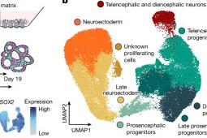
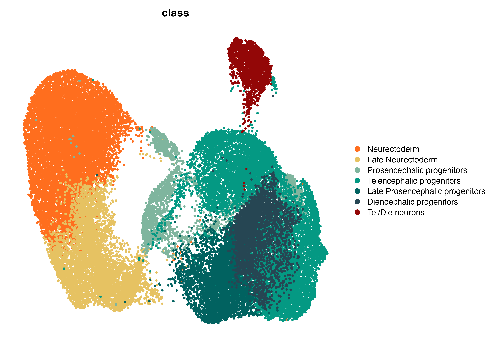
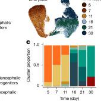
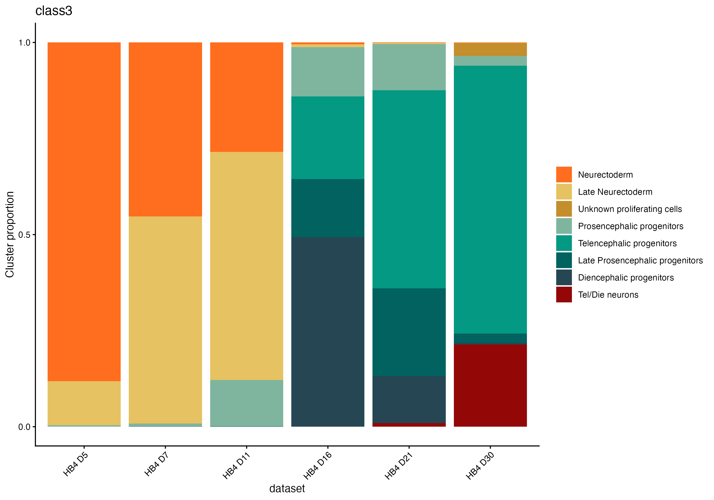

# Morphodynamics of Human Early Brain Organoid Development

Reproducing Figure 1 from [Jain et al. 2025](https://www.nature.com/articles/s41586-025-09151-3) (Nature), which maps the transcriptomic landscape of human brain organoid development from Day 5 to Day 30. This is part of my self-directed effort to build skills in single-cell genomics and computational biology.

## Results

### Paper (Fig 1b–c) vs My Reproduction

| | Paper | My reproduction |
|:---:|:---:|:---:|
| **Fig 1b** |  |  |
| Annotated UMAP (~41,000 cells, Day 5–30) | 15 clusters, 8 cell types | 14 clusters, 7 cell types |
| **Fig 1c** |  |  |
| Cell type proportions over time | Neurectoderm → Tel/Die progenitors | Neurectoderm → Tel/Die progenitors |

## Pipeline

`fig1_morphodynamics_prescale.R` implements the full analysis:

1. QC filtering (nFeature 1,000–7,500, MT < 10%)
2. Log-normalization and cell cycle scoring
3. Scaling with cell cycle regression
4. PCA and CSS integration across timepoints
5. Cell cycle regression from CSS embeddings
6. Clustering and UMAP
7. Marker-based cell type annotation (dot plot + average expression)
8. Visualization (annotated UMAP, timepoint UMAP, stacked bar plot)

## Cell types identified

Neurectoderm · Late Neurectoderm · Prosencephalic progenitors · Telencephalic progenitors · Late Prosencephalic progenitors · Diencephalic progenitors · Tel/Die neurons

## Tech Stack

R · Seurat · simspec (CSS) · ggplot2 · MetBrewer
